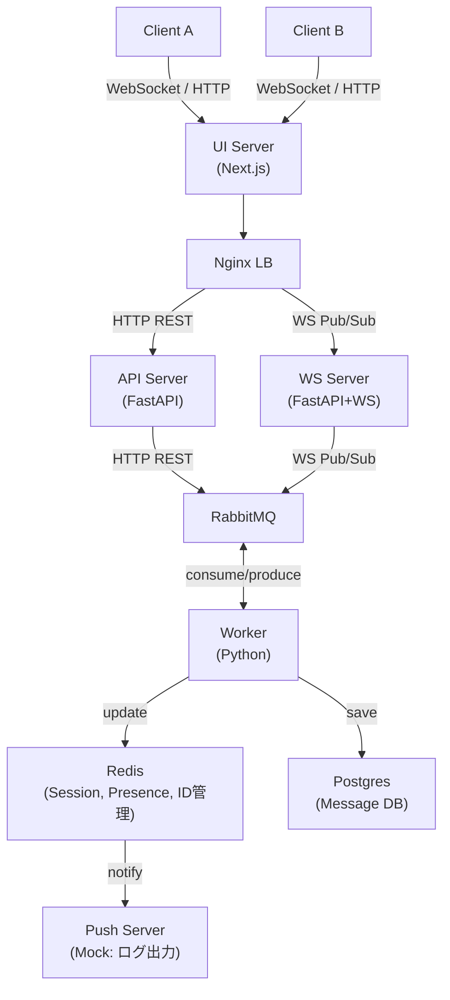

```mermaid
graph TD
    ClientA["Client A"]
    ClientB["Client B"]
    UIServer["UI Server<br/>(Next.js)"]
    NginxLB["Nginx LB"]
    APIServer["API Server<br/>(FastAPI)"]
    WSServer["WS Server<br/>(FastAPI+WS)"]
    RabbitMQ["RabbitMQ"]
    Worker["Worker<br/>(Python)"]
    Redis["Redis<br/>(Session, Presence, ID管理)"]
    Postgres["Postgres<br/>(Message DB)"]
    PushServer["Push Server<br/>(Mock: ログ出力)"]

    ClientA -->|"WebSocket / HTTP"| UIServer
    ClientB -->|"WebSocket / HTTP"| UIServer
    UIServer --> NginxLB
    NginxLB -->|"HTTP REST"| APIServer
    NginxLB -->|"WS Pub/Sub"| WSServer
    APIServer -->|"HTTP REST"| RabbitMQ
    WSServer -->|"WS Pub/Sub"| RabbitMQ
    RabbitMQ <-->|"consume/produce"| Worker
    Worker -->|"update"| Redis
    Worker -->|"save"| Postgres
    Redis -->|"notify"| PushServer
```
