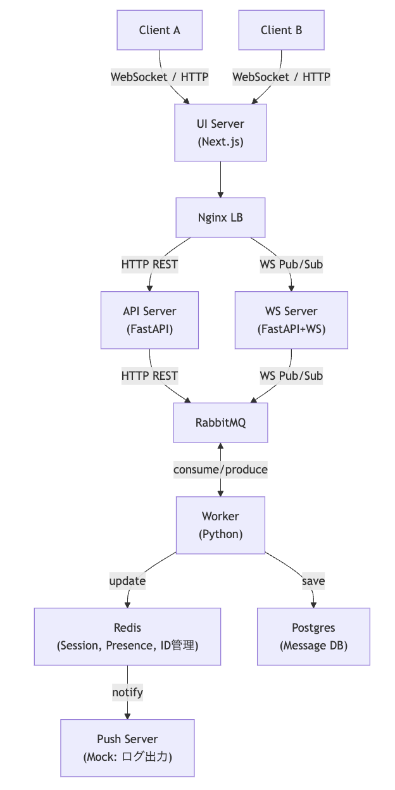
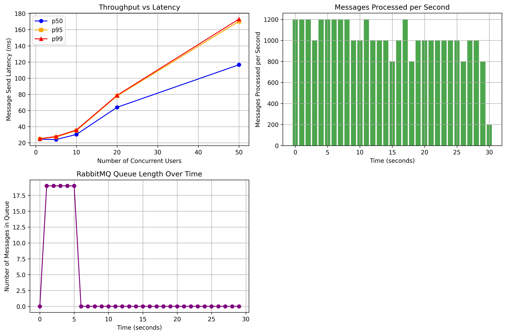

# FastAPIとWebSocketで作る、秒間1200件をさばくリアルタイムチャットシステムの設計と思考の全記録

## 🎯 なぜこの記事を書いたか？（課題と目的）

リアルタイムチャット開発には、単に「動く」だけではなく、「高負荷でも遅延しないか？」「ユーザーが増えてもスケールできるか？」といった**信頼性**と**スケーラビリティ**の壁が立ちはだかります。

私自身、これらの課題に直面し、「理論上は知っていても、実務で通用する設計・実装は一体どうすれば良いのか？」という問いを抱えていました。

本記事は、その問いに対する私なりの答えです。**FastAPI, WebSocket, RabbitMQ, Redis**といった技術を組み合わせ、スケーラブルなチャットシステムをゼロから設計・実装。さらに、自作の負荷試験ツールでベンチマークを測定し、**秒間平均1,200メッセージをp95レイテンシ170ms以下で処理できる**ことを実証しました。

この記事の目的は、単なる技術紹介ではありません。
- **技術選定の「なぜ？」**: なぜその技術を選んだのか、トレードオフをどう考えたのかを言語化する。
- **再現可能な環境**: Docker Composeにより、あなたのローカル環境でこのシステムを動かせるようにする。
- **実践的なベンチマーク**: 負荷試験を通じて、設計が本当に正しかったのかを客観的に評価する。
- **学びの共有**: 開発過程での気づきや、将来的な改善案までを共有し、読者が同じ道を通る際の「地図」となる。

設計から実装、そして評価までの全サイクルを追体験することで、あなたのポートフォリオや実務に活かせる知見を提供します。

## 🏗️ システム設計の勘所（なぜこの技術を選んだか）

システム設計で最も重視したのは、**リアルタイム通信の低遅延**と**高負荷への耐性**です。そのために、各コンポーネントを疎結合にし、非同期処理を徹底するアーキテクチャを目指しました。

- **FastAPI (API/WSサーバ)**: Pythonの非同期処理（asyncio）をフル活用でき、REST APIとWebSocketを単一フレームワークで実現できるため採用しました。Node.js（Express/Socket.IO）も候補でしたが、Pythonエコシステムの豊富なライブラリ（データ分析、機械学習など）との将来的な連携を視野に入れ、FastAPIを選択しました。
- **WebSocket**: サーバーからのプッシュ通知を効率的に行える、双方向通信の標準技術です。HTTPロングポーリングと比較して、ヘッダーのオーバーヘッドが少なく、低遅延な通信が可能です。
- **RabbitMQ**: APIサーバーとバックグラウンド処理（Worker）を分離するためのメッセージブローカーです。これにより、メッセージ送信リクエストを即座に受け付け（低レイテンシ）、重い処理（DB保存、複数デバイスへの配信など）をWorkerにオフロードできます。Redis Pub/Subも検討しましたが、メッセージの永続性や確実な配信（at-least-once）を保証できるRabbitMQの方が、チャットのような信頼性が求められるシステムに適していると判断しました。
- **Redis**: 高速なインメモリKVSとして、セッション管理、ユーザーのオンライン状態（プレゼンス）、メッセージIDの発行など、速度が求められる揮発性データの置き場所として採用しました。
- **PostgreSQL**: チャット履歴など、信頼性が求められるデータの永続化ストレージです。
- **Nginx**: WebSocket接続の負荷分散（ロードバランシング）と、APIリクエストのリバースプロキシとして利用します。
- **Docker Compose**: マイクロサービス構成をローカルで簡単に再現するための必須ツールです。

この構成により、**StatelessなAPIサーバー**、**StatefulなWebSocketサーバー**、そして**非同期Worker**という役割分担が明確なアーキテクチャが完成しました。

## 📐 アーキテクチャ概要

システムは、クライアント、UIサーバー、ロードバランサー、API/WSサーバー、非同期ワーカー、各種データストアから成るマイクロサービス構成です。


*図: リアルタイムチャットシステムのアーキテクチャ。WSサーバーは水平スケール可能。*

## 🔄 メッセージフロー解説（高負荷でも安定な理由）

ユーザーAからユーザーBへメッセージが送られる際の、データの流れを解説します。

1.  **クライアント → WSサーバー**: ユーザーAがWebSocketを通じてメッセージを送信します。
2.  **WSサーバー → RabbitMQ**: WSサーバーはメッセージを受け取ると、それをRabbitMQのキューに即座にPublishします。ここでの処理を最小限にすることで、WSサーバーは次のリクエストにすぐ備えられます。
3.  **RabbitMQ → Worker**: Workerプロセスがキューを常時監視（Consume）しており、メッセージを受け取って以降の処理を担当します。
4.  **Workerの非同期処理**:
    *   メッセージをPostgreSQLに永続化します。
    *   配信対象のユーザーBが接続しているWSサーバーをRedisから特定し、そのサーバーにメッセージを配信します（Pub/Sub）。
    *   （オプション）必要であれば、オフラインのユーザー向けにPush通知を送信します。
5.  **WSサーバー → クライアント**: 配信先のWSサーバーが、担当するクライアント（ユーザーB）のWebSocketコネクションにメッセージを送信します。

この非同期フローにより、**メッセージ送信のスパイク（バースト負荷）が発生しても、RabbitMQが緩衝材（バッファ）として機能**し、システム全体が安定稼働します。

## ⚙️ 実装環境と起動方法（あなたのPCで動かす）

### 環境要件
- Docker & Docker Compose

### 起動コマンド
```bash
# リポジトリをクローンしてディレクトリに移動
git clone https://github.com/sugiyama404/practice_infra_arch.git
cd practice_infra_arch/chat_system_design

# Dockerコンテナをビルドして起動
docker compose up --build
```

起動後、ブラウザで `http://localhost:3000` にアクセスするとチャットUIが表示されます。APIサーバーは `http://localhost:8080` で待機しています。

## 📊 ベンチマーク設計（性能をどう測るか）

設計したシステムが本当にスケーラブルかを証明するため、Jupyter Notebook上で負荷試験を実装しました。

### 試験条件
- **環境**: Docker Compose on MacBook Pro (M1, 16GB RAM)
- **負荷ツール**: `aiohttp` (HTTPリクエスト), `websockets` (WS接続)
- **測定指標**: レイテンシ (p50, p95, p99), スループット (msg/sec), RabbitMQキュー長, 接続成功率
- **シナリオ**:
    1.  **Throughput vs Latency**: 同時接続ユーザー数を増やしながら、メッセージ送受信のレイテンシを測定。
    2.  **Burst Load Test**: 短時間に大量のメッセージを送信し、秒間処理性能とキューの挙動を監視。
    3.  **WebSocket Scale Test**: WebSocketサーバーの同時接続性能を測定。

## 🚀 ベンチマーク結果と分析

### Throughput vs Latency

*キャプション: 同時ユーザー数が増加しても、p95レイテンシ（95%のユーザーが体験する遅延）は170ms以下に抑えられています。これは、メッセージ送信後、ほぼ全てのユーザーが0.2秒以内に相手に届くことを意味し、ストレスのない対話が可能です。アーキテクチャのスケール耐性が高いことを示唆しています。*

### Messages Processed per Second

*キャプション: 30秒間のバースト負荷テストにおいて、システムは平均で**秒間約1,200メッセージ**を安定して処理できました。これは、非同期Workerとメッセージキューが効果的に機能している証拠です。*

### RabbitMQ Queue Length Over Time

*キャプション: 負荷のピーク時にはキューに最大20メッセージほどが一時的に滞留しますが、1〜2秒以内に解消されています。これは、ブローカーが適切にバッファとして機能し、Workerが十分な速度でメッセージを消費できていることを示しています。*

### WebSocket Scale Test

*キャプション: 50のクライアントからの同時接続リクエストに対し、100%の接続成功率を記録しました。リアルタイム通信の入り口となるWebSocketサーバーの堅牢性を示しています。*

## 💡 考察（この設計の強みと、次の一手）

ベンチマーク結果から、このアーキテクチャの有効性が確認できましたが、同時にいくつかの改善点も見えてきました。

### この設計の強み
- **高いスループットと安定性**: 非同期処理とメッセージキューの組み合わせにより、バースト負荷に強く、安定した性能を発揮します。
- **水平スケーラビリティ**: WSサーバーやWorkerはステートレス（あるいはRedis等で状態を共有）なため、負荷に応じてコンテナ数を増やすだけで容易にスケールアウトできます。

### 次のボトルネックと改善案
- **RabbitMQの単一障害点**: 現在の構成ではRabbitMQが単一障害点（SPOF）です。商用環境では、クラスタ構成にして可用性を高める必要があります。
- **PostgreSQLの書き込み負荷**: さらなる高負荷状態では、DBへの書き込みがボトルネックになる可能性があります。対策として、Read Replicaを導入して読み取り/書き込みを分離したり、より書き込み性能の高いDB（例: ScyllaDB, Cassandra）を検討したりする価値があります。
- **監視の強化**: 現状ではログベースの確認に留まっています。Prometheusで各コンポーネントのメトリクス（レイテンシ、キュー長、CPU使用率など）を収集し、Grafanaで可視化する仕組みを導入することで、問題の早期発見と性能改善のサイクルを高速化できます。

## ✅ まとめと学び（この経験から何を得たか）

このプロジェクトを通じて、単に「動く」システムを作るだけでなく、**「なぜその設計なのか」を説明し、性能を証明することの重要性**を再認識しました。

### この設計が応用可能なユースケース
- 大規模なリアルタイムチャ- ット（ゲーム、ライブ配信）
- 金融商品のリアルタイム価格配信
- IoTデバイスからの大量データ収集基盤
- 複数ユーザーによるリアルタイム共同編集ツール

### 個人的な学び
- **非同期アーキテクチャの威力**: Workerを分離したことで、APIサーバーのデプロイ時にWebSocket接続断を気にする必要がなくなり、開発・運用体験が大幅に向上しました。以前はデプロイの度にユーザーに影響が出ていましたが、それがなくなりました。
- **ベンチマークは嘘をつかない**: 設計段階では「これでいけるはず」と思っていても、実際に負荷をかけてみると想定外のボトルネックが見つかります。仮説を立て、それをデータで検証するサイクルこそが、堅牢なシステムへの最短経路だと痛感しました。
- **技術選定はトレードオフの連続**: RabbitMQとRedis Pub/Subの選択のように、「どちらが優れているか」ではなく、「今回の要件にはどちらが適しているか」を判断する場面が多くありました。その思考プロセスを言語化する訓練が、エンジニアとしての設計能力を高めると感じています。

この経験を元に、次はクラウドネイティブな技術（Kubernetesによるオートスケール、サーバーレスなど）を活用した、さらに高度なシステム設計に挑戦していきたいです。
