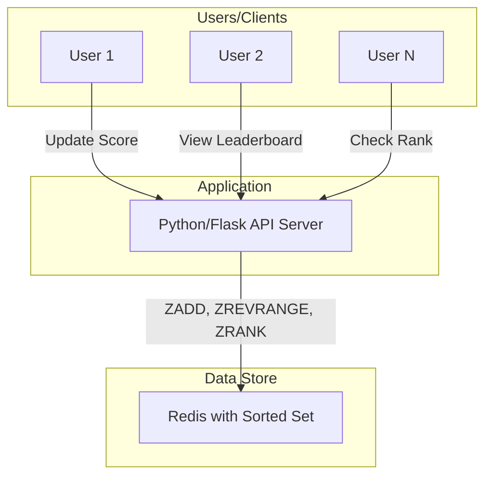
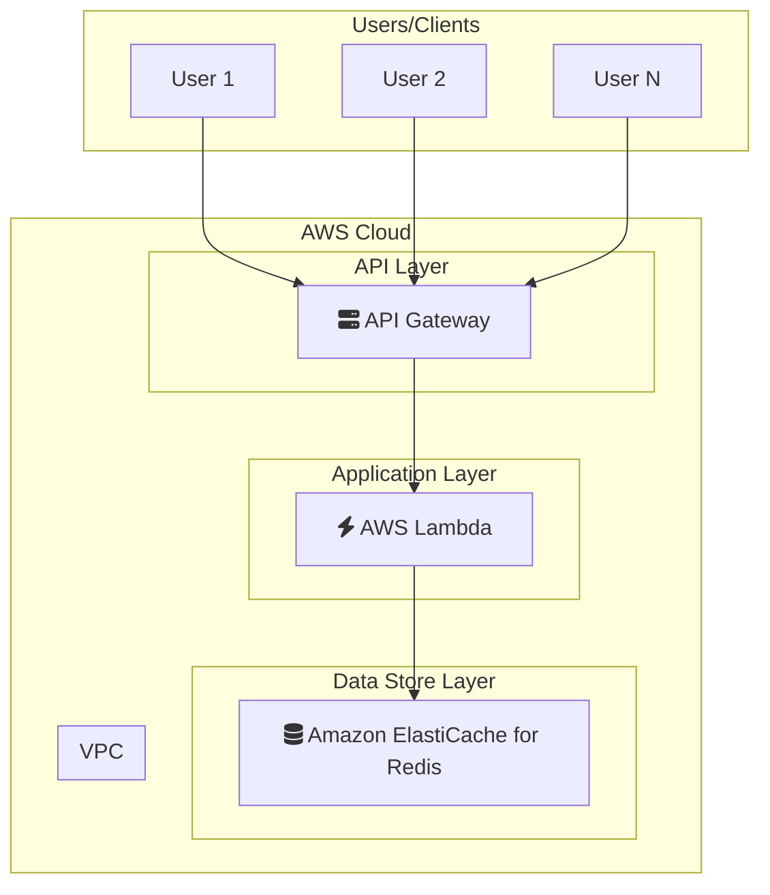

# Leaderboard (Ranking System) Pattern

## 概要
RedisのSorted Setを活用したリアルタイムランキングシステムの実装。
スコアの更新、ランキングの取得、特定ユーザーの順位確認などを学習。

## アーキテクチャ
- Redis Sorted Set: メンバー（ユーザーID）とスコアを効率的に管理
- キー設計: `leaderboard:{game_id}`

## 学習ポイント
- Sorted Setの`ZADD`, `ZREVRANGE`, `ZRANK`コマンドの活用
- 同点スコアの処理
- 大規模ランキングのパフォーマンス最適化（ページネーション）
- 複数ランキングの管理

---

### システム構成図

**解説:**
このシステムは、RedisのSorted Setデータ構造を利用してリアルタイムのランキング（リーダーボード）を実装しています。
1.  ユーザー（クライアント）は、スコアの更新、ランキングの表示、または自身の順位の確認をAPIサーバーにリクエストします。
2.  APIサーバーは、リクエストに応じてRedisのSorted Setコマンド（`ZADD`でスコアを追加/更新、`ZREVRANGE`でランキングを取得、`ZRANK`で特定のユーザーの順位を取得）を実行します。
3.  Redisはスコアに基づいてメンバーを自動的にソートして保持しているため、これらの操作を非常に高速に実行できます。結果はAPIサーバーを経由してユーザーに返されます。

### AWS構成図

**解説:**
このAWS構成では、リアルタイムランキングシステムをサーバーレスアーキテクチャで構築します。

*   **Python/Flask API Server → AWS Lambda:**
    ランキングロジックを実行するアプリケーションは、サーバーレスコンピューティングサービスであるAWS Lambdaで実装します。Lambdaはリクエストに応じてコードを実行し、トラフィックに応じて自動的にスケールするため、サーバーの管理が不要です。API Gatewayと組み合わせることで、簡単にAPIエンドポイントを作成できます。
*   **Redis Sorted Set → Amazon ElastiCache for Redis:**
    ランキングデータを保持するRedisは、フルマネージドサービスのAmazon ElastiCache for Redisに置き換えます。ElastiCacheは、Redisのセットアップ、運用、スケーリングを簡素化し、ミリ秒未満のレイテンシでSorted Setの操作を実行できるため、リアルタイムランキングシステムに最適です。
*   **Client Access → Amazon API Gateway:**
    API Gatewayをシステムのフロントに配置し、Lambda関数をトリガーします。API Gatewayは、リクエストの認証、スロットリング、キャッシュなどの機能を提供し、安全でスケーラブルなAPIを構築するのに役立ちます。

このサーバーレス構成により、運用負荷を最小限に抑えながら、大規模なトラフィックにも対応できる、コスト効率とスケーラビリティに優れたリアルタイムランキングシステムをAWS上に構築できます。
