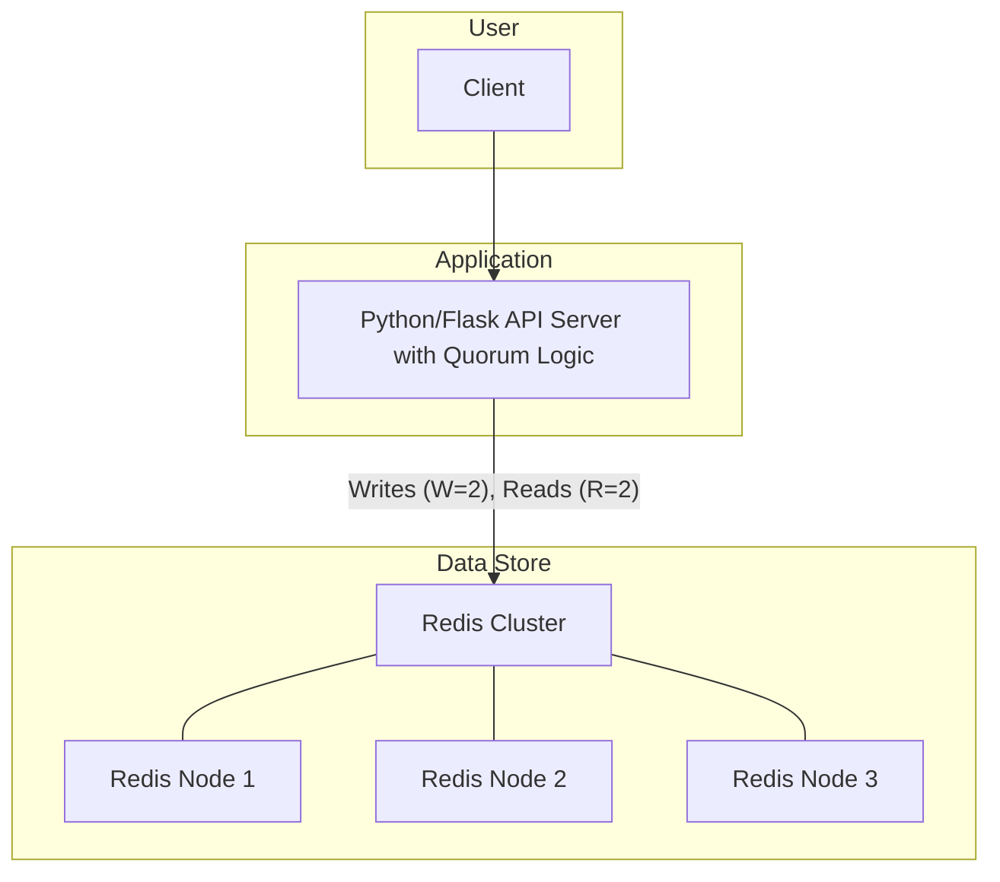
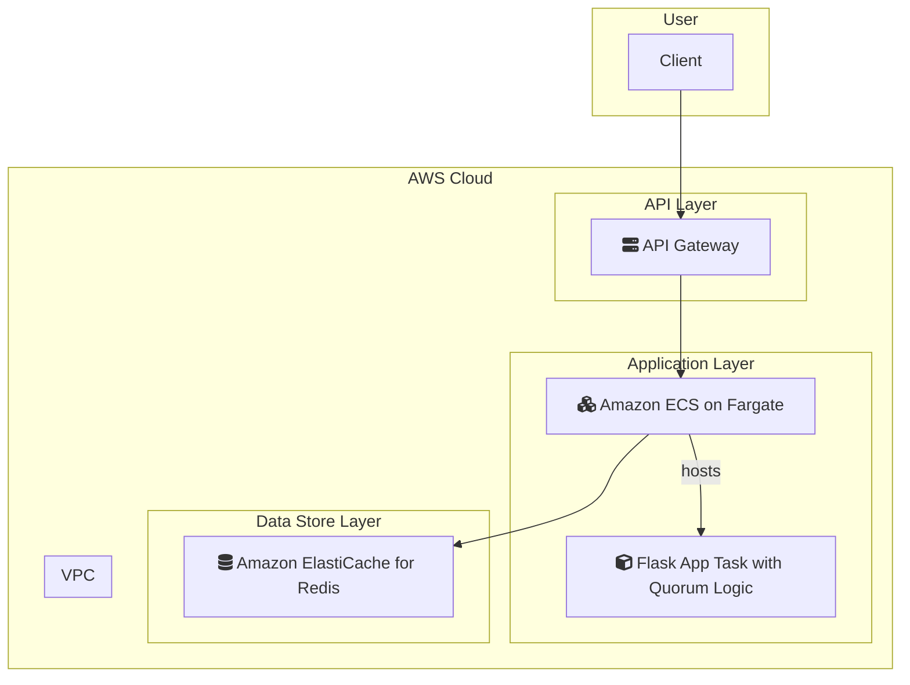

# 2-quorum-consistency

## 概要
W+R>Nのクォーラム設定による強一貫性KVS実装例。ベクトルクロック競合検出・ヒンテッドハンドオフ・リードリペア・Merkle Tree整合性検証を備えています。

## 構成
- Redis 3ノードクラスタ（docker-composeで起動）
- Python/Flask APIサーバ（app.py/quorum_server.py）

## 機能
- N=3, W=2, R=2のクォーラム設定
- ベクトルクロックによる競合検出と解決
- ヒンテッドハンドオフ（障害ノード分の書き込み代理保存）
- リードリペア（読み込み時のデータ不整合修復）
- Merkle Treeによるデータ整合性検証
- 最終的整合性からの強一貫性昇格
- ネットワーク分断時の動作制御

## 起動方法
1. Redisクラスタ起動
```bash
docker-compose up -d
```
2. Python依存インストール
```bash
pip install -r requirements.txt
```
3. APIサーバ起動
```bash
python app.py
```

## API例
- `/write` 書き込み（W=2クォーラム）
- `/read` 読み込み（R=2クォーラム、競合時リードリペア）
- `/flush_hinted` 障害ノード復旧時のヒンテッドハンドオフ反映
- `/integrity` Merkle Tree整合性検証
- `/status` ノード状態

## テスト手順
1. Redisノードを1つ停止し、`/write`でヒンテッドハンドオフ挙動確認
2. `/read`でベクトルクロック競合検出・リードリペア挙動確認
3. `/flush_hinted`で障害ノード復旧
4. `/integrity`でMerkle Tree整合性検証

## クォーラム理論・CAP定理実装例
- W+R>Nで強一貫性（CP）を保証
- ベクトルクロックで競合検出・解決
- 障害ノードはヒンテッドハンドオフで代理保存、復旧時に反映
- Merkle Treeで全体整合性を検証

---

### システム構成図



**解説:**
クライアントは、クォーラムロジックを実装したPython/Flask APIサーバーと通信します。このサーバーは、書き込み(W=2)と読み込み(R=2)のクォーラムを保証することで、データの強一貫性を実現します。障害発生時にはヒンテッドハンドオフ、読み込み時にはリードリペアを行い、データの整合性を維持します。データストアとしては3ノードのRedisクラスタが利用されます。

### AWS構成図



**解説:**
このAWS構成では、オンプレミスの各コンポーネントをAWSのマネージドサービスにマッピングしています。

*   **Python/Flask API Server → Amazon ECS on Fargate:**
    クォーラムロジックを含むコンテナ化されたアプリケーションは、サーバーレスコンテナ実行環境であるECS on Fargateにデプロイします。これにより、インフラ管理が不要になり、負荷に応じた自動スケーリングが可能になります。
*   **Redis Cluster → Amazon ElastiCache for Redis:**
    Redisクラスタは、フルマネージドサービスのAmazon ElastiCache for Redisに置き換えます。ElastiCacheは、セットアップ、運用、スケーリングを簡素化し、高い可用性とパフォーマンスを提供します。
*   **Client Access → Amazon API Gateway:**
    API Gatewayをシステムの入り口とすることで、リクエストの認証、スロットリング、モニタリングなどの機能を利用でき、システムのセキュリティと信頼性を向上させます。

この構成により、強一貫性を保証するKVSを、スケーラブルで運用効率の高いシステムとしてAWS上に構築できます。
