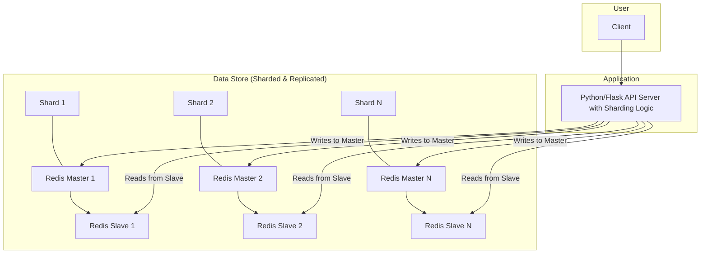
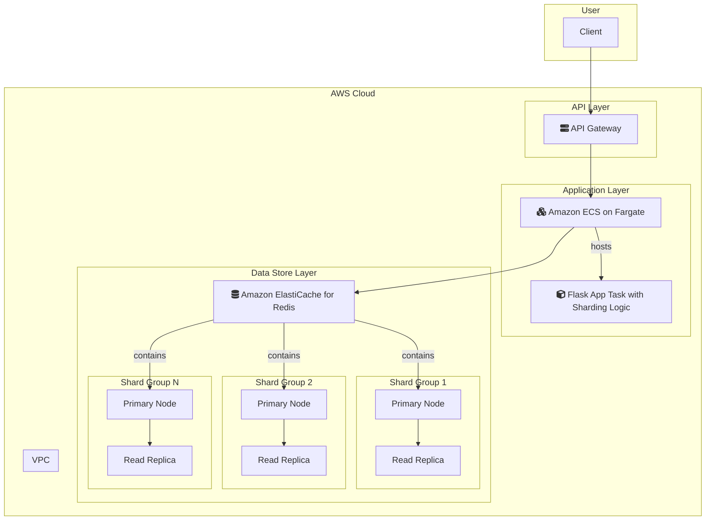

# 5-sharding-replica

## 概要
コンシステントハッシュ＋マスター・スレーブレプリケーションによるスケーラブルKVS実装例。ホットスポット回避・オートスケーリング・読み書き分離・障害検知・再分散を備えています。

## 構成
- Redis（docker-composeで起動）
- Python/Flask APIサーバ（app.py/sharding_server.py）

## 機能
- コンシステントハッシュによるデータシャーディング
- 仮想ノード（Virtual Node）によるホットスポット緩和
- マスター・スレーブレプリケーション構成
- 読み書き分離（Read/Write Split）
- 動的ノード追加・削除（Auto Scaling）
- データ再分散（Rebalancing）
- 障害ノードの自動検知と切り替え

## 起動方法
1. Redis起動
```bash
docker-compose up -d
```
2. Python依存インストール
```bash
pip install -r requirements.txt
```
3. APIサーバ起動
```bash
python app.py
```

## API例
- `/write` 書き込み（コンシステントハッシュ分散）
- `/read` 読み込み（スレーブから取得）
- `/add_node` ノード追加
- `/remove_node` ノード削除
- `/rebalance` データ再分散
- `/status` ノード状態

## テスト手順
1. `/write`で複数キー分散・ホットスポット緩和確認
2. `/add_node`・`/remove_node`でオートスケーリング挙動確認
3. `/rebalance`でデータ再分散
4. `/status`で障害ノード検知

## シャーディング戦略・スケーラビリティ設計
- コンシステントハッシュ＋仮想ノードで均等分散・ホットスポット回避
- マスター・スレーブで高可用性・読み書き分離
- ノード追加・削除・再分散でスケールアウト容易

---

### システム構成図



**解説:**
クライアントからのリクエストは、シャーディングロジックを持つPython/Flask APIサーバーに送られます。このサーバーはコンシステントハッシュ法を用いて、書き込みリクエストを適切なRedisマスターノードに振り分けます。読み込みリクエストは、負荷分散と高可用性のためにスレーブノードに送られます。この構成により、システムの水平スケーリングと読み書き性能の向上が実現されます。

### AWS構成図



**解説:**
このAWS構成では、スケーラブルなKVSをAWSのマネージドサービスで構築します。

*   **Python/Flask API Server → Amazon ECS on Fargate:**
    シャーディングロジックを持つアプリケーションは、ECS on Fargateで実行します。これにより、サーバーの管理が不要になり、トラフィックに応じてコンテナ数を自動でスケールさせることができます。
*   **Redis Master-Slave → Amazon ElastiCache for Redis (Cluster Mode Enabled):**
    シャーディングとレプリケーションの機能は、ElastiCache for Redisのクラスターモードを利用して実現します。ElastiCacheがノードの追加・削除、データの再分散、フェイルオーバーを自動的に管理してくれるため、運用負荷が大幅に軽減されます。
*   **Client Access → Amazon API Gateway:**
    API Gatewayをフロントに置くことで、APIのライフサイクル管理、セキュリティ、モニタリングを一元的に行うことができます。

この構成により、高いスケーラビリティ、可用性、そして運用効率を兼ね備えた分散KVSをAWS上で実現できます。
