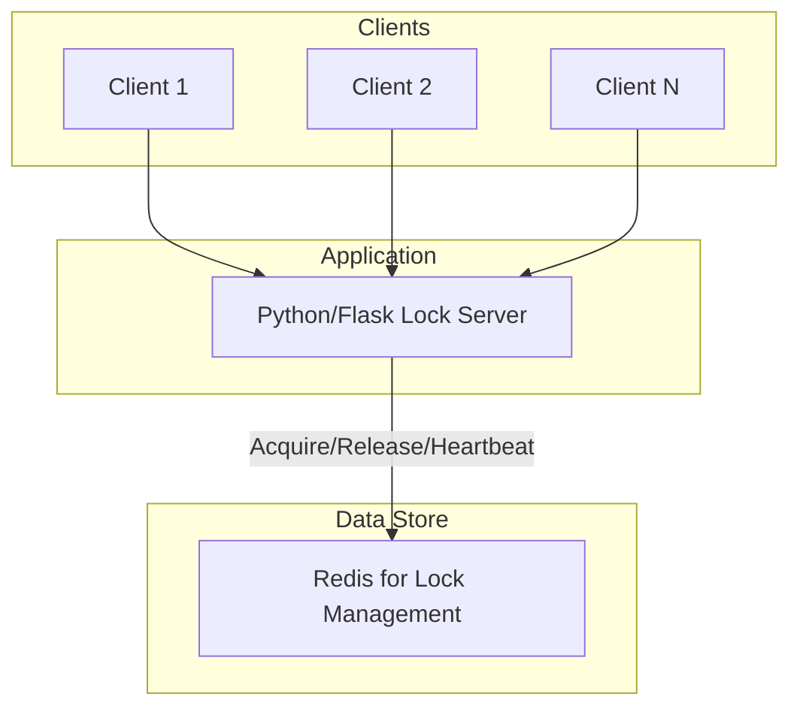
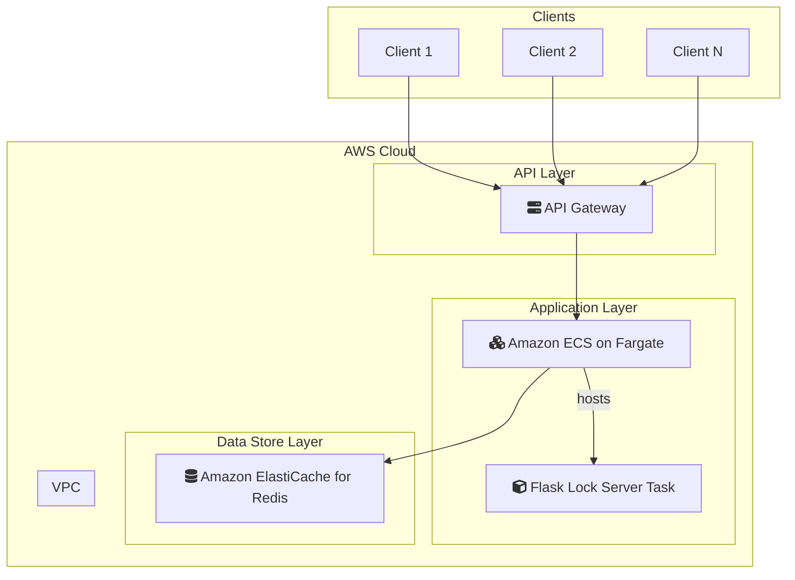

# 6-distributed-lock

## 概要
Redlockアルゴリズム＋TTLリース管理による分散排他制御システム実装例。デッドロック回避・障害ノード対応・統計監視・待機キューを備えています。

## 構成
- Redis（docker-composeで起動）
- Python/Flask APIサーバ（app.py/lock_server.py）

## 機能
- Redlockアルゴリズムによる分散ロック
- TTL（Time To Live）ベースのリース管理
- ロック保持者の定期的なハートビート
- デッドロック検出と自動解除
- ロック待機キュー
- 障害ノード時のロック自動解放
- ロック統計情報の収集と監視

## 起動方法
1. Redis起動
```bash
docker-compose up -d
```
2. Python依存インストール
```bash
pip install -r requirements.txt
```
3. APIサーバ起動
```bash
python app.py
```

## API例
- `/acquire` ロック取得（待機キュー管理）
- `/release` ロック解放
- `/heartbeat` ハートビート送信
- `/stats` ロック統計情報

## テスト手順
1. `/acquire`で複数クライアント同時ロック取得・待機キュー挙動確認
2. `/heartbeat`でリース延長
3. `/release`でロック解放
4. TTL切れ・ハートビート切れ時の自動解除
5. `/stats`で統計監視

## 分散ロックアルゴリズム詳細
- Redlockは複数Redisノードでロック取得多数決
- TTLリースでデッドロック・障害ノード時の自動解放
- 待機キューで公平な排他制御
- ハートビートでリース延長・障害検知

---

### システム構成図



**解説:**
複数のクライアントが、共有リソースへのアクセスを制御するために、Pythonで実装されたロックサーバーにロックの取得・解放をリクエストします。ロックサーバーは、RedlockアルゴリズムとTTL（Time To Live）ベースのリース管理を用いて、Redis上で分散ロックを実現します。これにより、複数のクライアント間での排他制御を保証し、デッドロックや障害発生時にも安全にロックを管理します。

### AWS構成図



**解説:**
このAWS構成では、分散ロックシステムをAWSのマネージドサービスで構築します。

*   **Python/Flask Lock Server → Amazon ECS on Fargate:**
    ロックサーバーアプリケーションは、コンテナ化してECS on Fargateで実行します。これにより、サーバーのプロビジョニングや管理が不要になり、リクエスト数に応じて自動的にスケールすることが可能です。
*   **Redis → Amazon ElastiCache for Redis:**
    ロック情報の管理に使用するRedisは、フルマネージドサービスのAmazon ElastiCache for Redisに置き換えます。ElastiCacheは高可用性構成を容易に組むことができ、Redlockアルゴリズムが必要とする複数の独立したRedisノードを提供できます。
*   **Client Access → Amazon API Gateway:**
    API Gatewayを介してロックサーバーにアクセスすることで、認証、リクエストの流量制御、ロギングなどの機能を利用でき、システムの信頼性とセキュリティを高めます。

この構成により、スケーラブルで信頼性の高い分散ロックサービスをAWS上で効率的に運用することができます。
