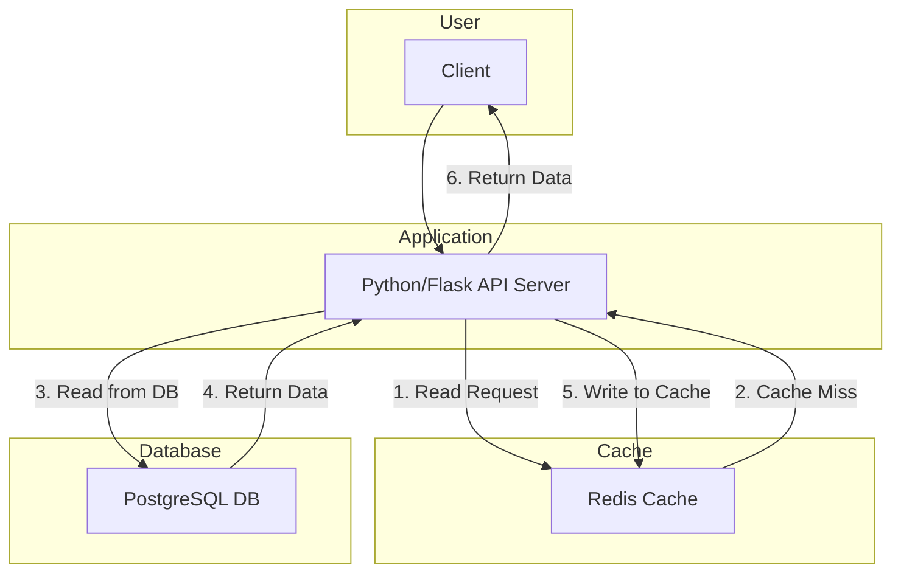
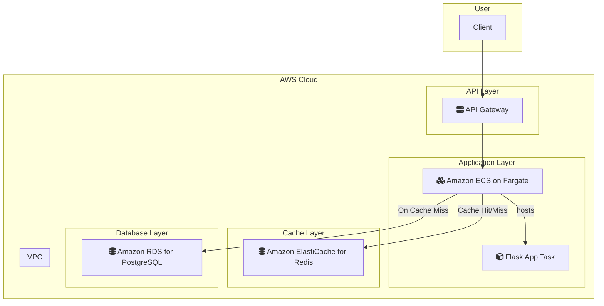

# Cache-Aside Pattern KVS

## 概要
読み取り性能最適化のためのキャッシュサイドパターン実装。
Cache Miss時のDB読み込み、TTL管理、キャッシュ無効化戦略を学習。

## アーキテクチャ
- Redis: キャッシュレイヤー
- PostgreSQL: プライマリDB（シミュレーション）
- キー設計: `cache:{entity_type}:{id}`

## 学習ポイント
- Cache-Aside vs Write-Through の使い分け
- TTL設定とキャッシュ無効化戦略
- Cache Warming と Cache Stampede 対策
- 読み取り負荷軽減とレスポンス時間短縮

---

### システム構成図

**解説:**
このシステムは、キャッシュアサイド（Cache-Aside）パターンを実装しています。
1.  クライアントからの読み取りリクエストを受け取ったアプリケーションサーバーは、まずRedisキャッシュにデータが存在するか問い合わせます。
2.  キャッシュにデータが存在すれば（キャッシュヒット）、そのデータをクライアントに返します。
3.  キャッシュにデータが存在しない場合（キャッシュミス）、アプリケーションサーバーはプライマリデータベースであるPostgreSQLからデータを読み取ります。
4.  データベースから取得したデータをRedisキャッシュに格納します。
5.  最後に、取得したデータをクライアントに返します。
このパターンにより、データベースへの負荷が軽減され、読み取り性能とレスポンス時間が向上します。

### AWS構成図

**解説:**
このAWS構成では、キャッシュアサイドパターンをマネージドサービスで効率的に実現します。

*   **Python/Flask API Server → Amazon ECS on Fargate:**
    アプリケーションロジックは、サーバーレスコンテナサービスのECS on Fargateで実行します。これにより、インフラの管理を気にすることなく、アプリケーションのスケーリングと運用に集中できます。
*   **Redis Cache → Amazon ElastiCache for Redis:**
    キャッシュレイヤーには、フルマネージドなインメモリデータストアであるAmazon ElastiCache for Redisを利用します。これにより、キャッシュクラスタのセットアップ、パッチ適用、バックアップなどの運用タスクが自動化されます。
*   **PostgreSQL DB → Amazon RDS for PostgreSQL:**
    プライマリデータベースには、リレーショナルデータベースサービスであるAmazon RDS for PostgreSQLを使用します。RDSは、データベースのプロビジョニング、パッチ適用、バックアップ、フェイルオーバーなどを自動化し、高い可用性と信頼性を提供します。
*   **Client Access → Amazon API Gateway:**
    API Gatewayをシステムの入り口とすることで、APIのセキュリティ、モニタリング、バージョン管理などを容易に行えます。

この構成により、パフォーマンス、スケーラビリティ、運用性に優れたシステムをAWS上に構築できます。
