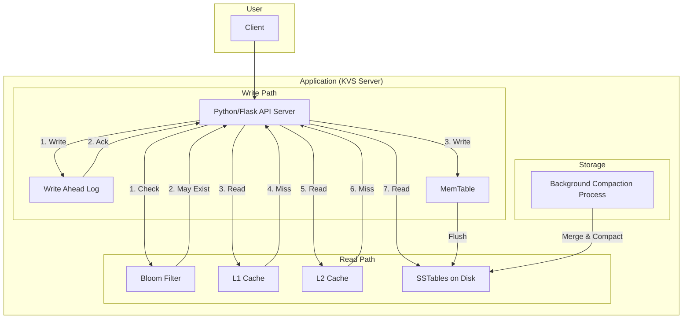

# 6-bloom-sstable

## 概要
ブルームフィルタ＋SSTableライクな永続化・LSM-Tree圧縮によるパフォーマンス最適化KVS実装例。コミットログ・メモリテーブル・キャッシュ階層・非同期圧縮を備えています。

## 構成
- Python/Flask APIサーバ（app.py/bloom_sstable_server.py）

## 機能
- ブルームフィルタによる高速存在チェック
- コミットログ（WAL: Write Ahead Log）
- メモリテーブル（MemTable）とディスク永続化
- SSTableライクなソート済みファイル構造
- LSM-Tree風の多レベル圧縮
- バックグラウンドでの非同期圧縮処理
- キャッシュ階層化（L1, L2キャッシュ）

## 起動方法
1. Python依存インストール
```bash
pip install -r requirements.txt
```
2. APIサーバ起動
```bash
python app.py
```

## API例
- `/put` 書き込み（WAL, MemTable, Bloom, L2/SSTable反映）
- `/get` 読み込み（Bloom→L1→L2→SSTable階層検索）
- `/compact` LSM-Tree圧縮
- `/stats` キャッシュ・Bloom・SSTable統計

## テスト手順
1. `/put`で複数キー書き込み・Bloom存在チェック
2. `/get`でキャッシュ階層・SSTable検索挙動確認
3. `/compact`で圧縮・ファイル統合
4. `/stats`で各階層統計確認

## LSM-Treeアーキテクチャ解説
- MemTable（メモリ）→SSTable（ディスク）→圧縮統合
- Bloom Filterで高速存在判定
- WALで耐障害性
- L1/L2キャッシュで高速アクセス

---

### システム構成図



**解説:**
このシステムは、LSM-Tree（Log-Structured Merge-Tree）ベースのKVSアーキテクチャを実装しています。

*   **書き込みパス:**
    書き込みリクエストは、まず耐障害性のためにWAL（Write-Ahead Log）に記録され、その後メモリ上のMemTableに書き込まれます。MemTableがいっぱいになると、ソート済みのSSTable（Sorted String Table）としてディスクにフラッシュされます。

*   **読み込みパス:**
    読み込みリクエストは、まずブルームフィルタでキーの存在確率を高速にチェックします。存在の可能性がある場合、L1キャッシュ、L2キャッシュ、MemTable、そしてディスク上のSSTableの順でデータを検索します。

*   **バックグラウンド処理:**
    バックグラウンドでは、ディスク上のSSTableをマージして新しいSSTableを作成するコンパクション（圧縮）処理が非同期で行われ、読み取り性能の維持とディスク容量の効率化を図ります。

### AWS構成図

```mermaid
graph TD
    subgraph "User"
        Client[Client]
    end

    subgraph "AWS Cloud"
        subgraph "API & Application Layer"
            ECS[fa:fa-cubes Amazon ECS on Fargate]
            AppTask[fa:fa-cube Flask App Task]
            ECS -- hosts --> AppTask
        end

        subgraph "Storage Layer"
            EBS[fa:fa-hdd Amazon EBS]
            S3[fa:fa-archive Amazon S3 for WAL & SSTable Backup]
        end

        subgraph "Cache Layer"
            DAX[fa:fa-bolt Amazon DynamoDB Accelerator (DAX) for Caching]
        end

        subgraph "VPC"
            Client --> ECS
            AppTask -- "attaches" --> EBS
            AppTask -- "backs up to" --> S3
            AppTask -- "uses" --> DAX
        end
    end
```

**解説:**
このAWS構成では、LSM-TreeベースのKVSをAWSのサービスで構築します。

*   **Python/Flask API Server → Amazon ECS on Fargate:**
    アプリケーションサーバーは、ECS on Fargateで実行します。コンテナにアタッチするストレージとしてEBSを利用し、SSTableなどのデータを永続化します。
*   **WAL & SSTable Storage → Amazon EBS & S3:**
    アクティブなデータ（最新のSSTableやWAL）は、高速なブロックストレージであるAmazon EBSに保存します。古いSSTableやWALのバックアップは、コスト効率と耐久性に優れたAmazon S3にアーカイブします。
*   **Cache Hierarchy (Bloom Filter, L1/L2) → Amazon DynamoDB Accelerator (DAX) / ElastiCache:**
    ブルームフィルタやキャッシュ階層は、アプリケーションメモリ内で実装するか、または超低レイテンシが求められる場合はAmazon ElastiCache for Redisや、DynamoDBと組み合わせる場合はDAX（DynamoDB Accelerator）のようなインメモリキャッシュサービスを利用します。この図ではDAXをキャッシュ層の代表として示しています。
*   **Background Compaction → AWS Lambda / Fargate Task:**
    非同期のコンパクション処理は、定期的に実行されるAWS Lambda関数や、別のFargateタスクとして実装することができます。これにより、メインのアプリケーションサーバーから重い処理をオフロードできます。

この構成により、書き込みが多く、高いスループットが求められるワークロードに対して、スケーラブルでコスト効率の良いKVSをAWS上に構築できます。
