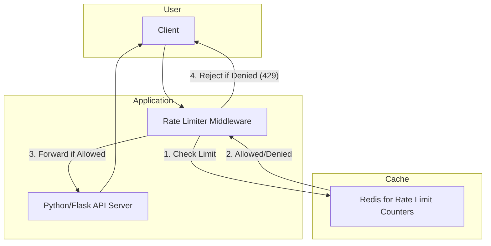
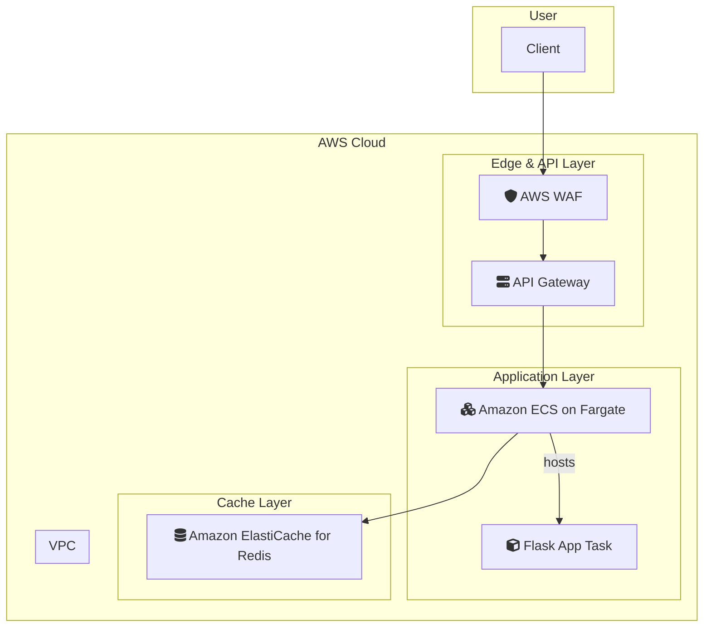

# Rate Limiting Pattern

## 概要
Redisを活用したAPIレート制限の実装。
固定ウィンドウ、スライディングウィンドウ、トークンバケットなどのアルゴリズムを学習。

## アーキテクチャ
- Redis: リクエストカウンタとタイムスタンプを保存
- キー設計: `rate_limit:{user_id}:{endpoint}`

## 学習ポイント
- 各レート制限アルゴリズムの長所と短所
- スライディングウィンドウログによる精度向上
- 複数Redisコマンドの原子性（`MULTI`/`EXEC` or Lua Script）
- 複数リージョンでのグローバルレート制限

---

### システム構成図

**解説:**
このシステムは、APIへのリクエストを制御するためのレートリミッターを実装しています。
1.  クライアントからのリクエストは、まずレートリミッターミドルウェアに到達します。
2.  レートリミッターは、ユーザーIDやIPアドレスなどの識別子をキーとして、Redisに保存されているリクエスト回数とタイムスタンプを確認します。
3.  リクエストが制限内であれば、リクエストをバックエンドのAPIサーバーに転送します。
4.  リクエストが制限を超えている場合は、「Too Many Requests (429)」エラーをクライアントに返します。
この仕組みにより、APIの過剰な利用を防ぎ、サービスの安定性を保護します。

### AWS構成図

**解説:**
AWSでは、レート制限を複数のレイヤーで実装することが可能です。

*   **AWS WAF (Web Application Firewall):**
    最も手前で、IPアドレスに基づいた単純なレートベースのルールを適用できます。これにより、悪意のある大量のリクエストをアプリケーションに到達する前にブロックできます。
*   **Amazon API Gateway:**
    API GatewayのUsage Plan機能を利用することで、APIキーごとにきめ細かなレート制限（例：1秒あたりのリクエスト数）とクォータ（例：1日あたりのリクエスト数）を設定できます。これは、多くのユースケースで十分な機能を提供します。
*   **Custom Logic with ElastiCache:**
    API Gatewayの機能だけでは不十分な、より複雑なロジック（例：ユーザーIDごとの動的な制限）が必要な場合は、アプリケーション（この図ではECS on Fargate）内でカスタムロジックを実装し、状態の保存先としてAmazon ElastiCache for Redisを利用します。

この多層的なアプローチにより、基本的な保護から高度なカスタム制御まで、柔軟かつ堅牢なレート制限戦略をAWS上で実現できます。この図では、WAFとAPI Gatewayが主要なレート制限の役割を担い、必要に応じてアプリケーションレベルの制御を追加できる構成を示しています。
