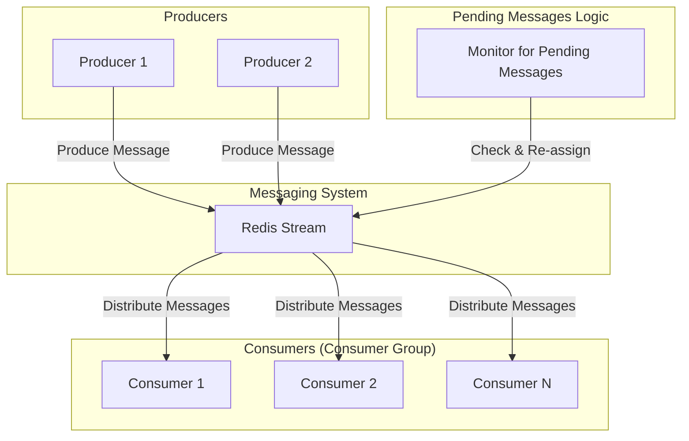

# 8-line-streams

## 概要
LINE風のRedis Streams永続化メッセージングシステム実装例。Consumer Groupによる並列処理、順序保証、障害復旧・フェイルオーバー・重複検知・容量制限を備えています。

## 構成
- Redis（docker-composeで起動）
- Python/Flask APIサーバ（app.py/stream_server.py）

## 機能
- Redis Streamsによる永続化メッセージキュー
- Consumer Groupによる並列メッセージ処理
- メッセージの順序保証とIDベース管理
- 未処理メッセージの自動再配信
- Consumer障害時の自動フェイルオーバー
- メッセージの重複処理検知
- ストリーム容量制限とトリミング

## 起動方法
1. Redis起動
```bash
docker-compose up -d
```
2. Python依存インストール
```bash
pip install -r requirements.txt
```
3. APIサーバ起動
```bash
python app.py
```

## API例
- `/produce` メッセージ送信
- `/consume` Consumer Groupで並列取得
- `/pending` 未処理一覧
- `/replay` 未処理再配信
- `/trim` 容量制限
- `/group_info` Consumer Group情報
- `/stream_info` ストリーム情報

## テスト手順
1. `/produce`で複数メッセージ送信
2. `/consume`で複数Consumer並列取得・順序保証確認
3. `/pending`・`/replay`で未処理・再配信挙動確認
4. Consumer停止時の自動フェイルオーバー（ログ出力）確認
5. `/trim`で容量制限・トリミング確認

## Streamsアーキテクチャ解説
- Redis StreamsはIDベースで順序・永続性を保証
- Consumer Groupで高スループット・障害復旧
- 未処理・重複・容量制限もAPIで管理可能

---

### システム構成図



**解説:**
このシステムは、Redis Streamsを利用したメッセージングシステムです。
*   **Producers:** メッセージを生成し、Redis Streamに送信します。
*   **Redis Stream:** メッセージを永続的に保存し、順序を保証するログ構造のデータストアです。
*   **Consumers:** コンシューマーグループを形成し、ストリームからメッセージを並行して受信・処理します。コンシューマーグループの機能により、各メッセージはグループ内の一つのコンシューマーにのみ配信されることが保証されます。
*   **Pending Messages Logic:** あるコンシューマーがメッセージの処理に失敗したり、クラッシュした場合、そのメッセージは「ペンディング（未処理）」状態になります。監視プロセスがこれらのペンディングメッセージを検出し、他のアクティブなコンシューマーに再割り当てすることで、メッセージの処理を保証します。

### AWS構成図

```mermaid
graph TD
    subgraph "Producers"
        ProducerApp[fa:fa-cube Producer Application (e.g., on ECS/Lambda)]
    end

    subgraph "Messaging/Streaming Service"
        Kinesis[fa:fa-random Amazon Kinesis Data Streams]
    end

    subgraph "Consumers"
        ConsumerApp[fa:fa-cube Consumer Application (e.g., on ECS/Lambda)]
    end

    subgraph "AWS Cloud"
        ProducerApp -- "PutRecord" --> Kinesis
        Kinesis -- "GetRecords" --> ConsumerApp
    end
```

**解説:**
Redis Streamsの機能をAWSのマネージドサービスで実現する場合、Amazon Kinesis Data Streamsが最も近い選択肢となります。

*   **Redis Stream → Amazon Kinesis Data Streams:**
    Kinesis Data Streamsは、リアルタイムで大量のデータを収集・処理・分析するためのスケーラブルで耐久性のあるストリーミングサービスです。シャード（Kinesis内の処理単位）を追加することでスループットをスケールでき、データの順序保証や複数コンシューマーによる並列処理をサポートします。これはRedis Streamsの機能と非常によく似ています。
*   **Producers & Consumers → AWS Lambda / Amazon ECS:**
    メッセージを生成するプロデューサーと、それを処理するコンシューマーは、サーバーレスのAWS LambdaやコンテナサービスのAmazon ECSなどで実装します。Kinesis Data StreamsとLambdaはネイティブに統合されており、ストリームにデータが到着すると自動的にLambda関数をトリガーすることができます。これにより、サーバーの管理なしでスケーラブルなストリーム処理アプリケーションを簡単に構築できます。
*   **Consumer Group & Failover:**
    Kinesisでは、複数のコンシューマーアプリケーションが同じストリームからデータを読み取ることができます。各コンシューマーは自身がどこまで読み取ったかを管理します（チェックポインティング）。障害が発生した場合、別のインスタンスが処理を引き継ぐことでフェイルオーバーを実現します。これはRedis Streamsのコンシューマーグループとペンディングメッセージの再配信機能に相当します。

この構成により、高スループットで信頼性の高いリアルタイムメッセージングシステムを、運用負荷を抑えながらAWS上に構築できます。
