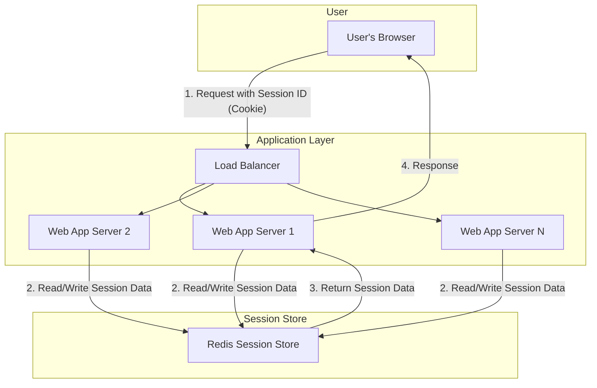
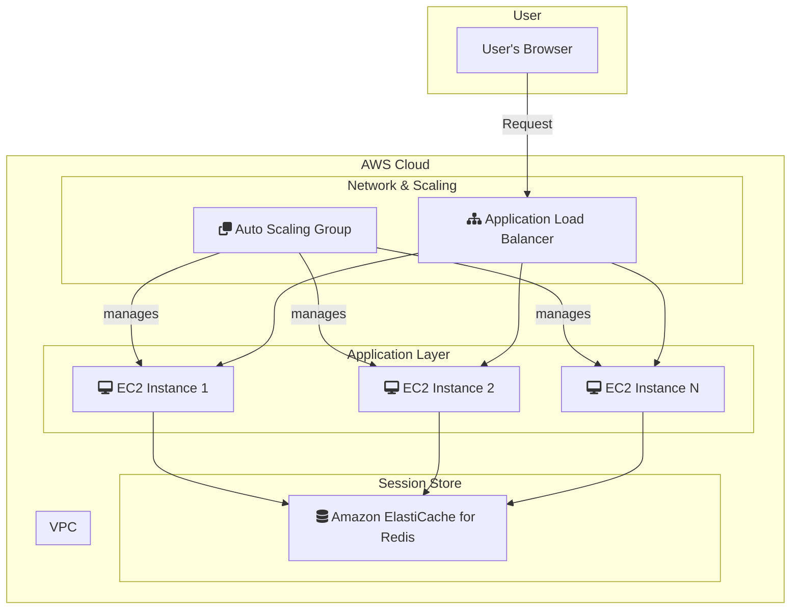

# Session Store Pattern

## 概要
Redisを高速なセッションストアとして利用する実装。
セッションデータの保存、取得、更新、削除、および有効期限管理を学習。

## アーキテクチャ
- Redis: セッションデータをJSON形式で保存
- キー設計: `session:{session_id}`

## 学習ポイント
- Cookieベースのセッション管理との連携
- セッションの有効期限（TTL）と自動延長
- セキュリティ（セッションIDの推測困難性）
- スケーラビリティと高可用性の確保

---

### システム構成図

**解説:**
このシステムは、ステートレスなWebアプリケーションでセッション情報を管理するために、外部のセッションストアを利用する構成です。
1.  ユーザーのブラウザは、リクエスト時にセッションIDをクッキーに含めて送信します。
2.  ロードバランサーはリクエストをいずれかのWebアプリケーションサーバーに転送します。
3.  Webアプリケーションサーバーは、受け取ったセッションIDをキーとして、Redisセッションストアからユーザーのセッションデータを読み書きします。
4.  セッションデータを処理に利用し、レスポンスをブラウザに返します。

このアーキテクチャにより、特定のサーバーにセッションが依存しない（セッションアフィニティが不要）ため、Webアプリケーション層を自由にスケールアウトできます。

### AWS構成図

**解説:**
このAWS構成は、スケーラブルで高可用なWebアプリケーションのための一般的なアーキテクチャです。

*   **Web App Servers → Amazon EC2 in Auto Scaling Group:**
    Webアプリケーションサーバーは、Amazon EC2インスタンス上で実行されます。これらのインスタンスはAuto Scaling Groupによって管理され、トラフィックの増減に応じてインスタンス数が自動的に調整されます。
*   **Load Balancer → Application Load Balancer (ALB):**
    ALBは、受信トラフィックを複数のEC2インスタンスに分散します。ALBはレイヤー7ロードバランサーであり、HTTP/HTTPSのヘッダーやパスに基づいてルーティングを行うことができます。
*   **Redis Session Store → Amazon ElastiCache for Redis:**
    セッションデータは、フルマネージドなインメモリデータストアであるAmazon ElastiCache for Redisに保存されます。これにより、アプリケーションサーバーはステートレスになり、どのインスタンスでもユーザーリクエストを処理できるようになります。ElastiCacheは高可用性と低レイテンシを提供し、セッション管理に最適です。

この構成により、アプリケーション層を独立してスケールさせることができ、単一障害点のない、堅牢でパフォーマンスの高いシステムを構築できます。
