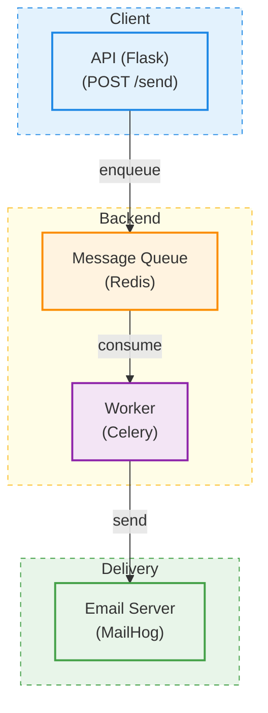

```mermaid
graph TD;

    subgraph Client
        A["API (Flask)\n(POST /send)"]
    end

    subgraph Backend
        B["Message Queue\n(Redis)"]
        C["Worker\n(Celery)"]
    end

    subgraph Delivery
        D["Email Server\n(MailHog)"]
    end

    %% 矢印の流れ (縦方向)
    A -->|enqueue| B -->|consume| C -->|send| D

    %% 色指定
    style A fill:#E3F2FD,stroke:#1E88E5,stroke-width:2px
    style B fill:#FFF3E0,stroke:#FB8C00,stroke-width:2px
    style C fill:#F3E5F5,stroke:#8E24AA,stroke-width:2px
    style D fill:#E8F5E9,stroke:#43A047,stroke-width:2px

    %% サブグラフの色（背景）
    style Client fill:#E3F2FD,stroke:#1E88E5,stroke-width:1px,stroke-dasharray: 5 5
    style Backend fill:#FFFDE7,stroke:#FBC02D,stroke-width:1px,stroke-dasharray: 5 5
    style Delivery fill:#E8F5E9,stroke:#43A047,stroke-width:1px,stroke-dasharray: 5 5
```
