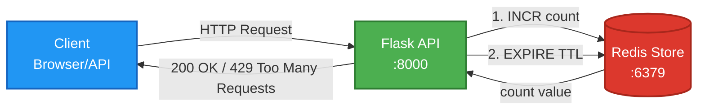
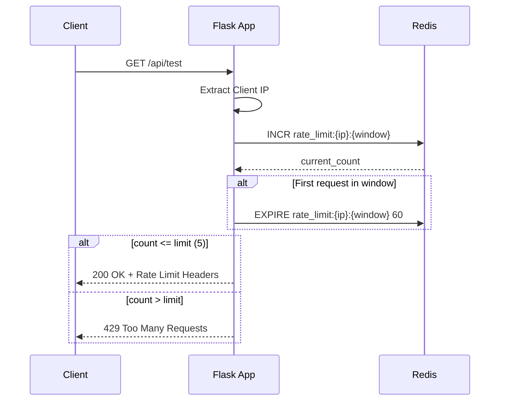
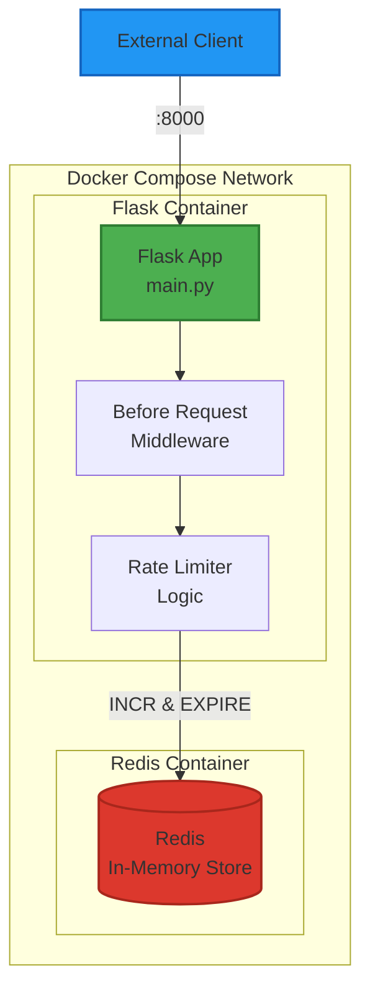

# Rate Limiter System Architecture

## System Overview

本システムは、**固定ウィンドウカウンター方式（Fixed Window Counter）**を採用した分散レートリミッターです。
RedisのアトミックなINCR操作とEXPIREコマンドを活用し、一定時間内のAPIリクエスト数を制限します。

## Architecture Diagram



## Sequence Diagram



## Component Architecture



## Fixed Window Counter Algorithm

### Core Concept

1. **Time Window**: 時間を固定ウィンドウ（例: 60秒）に分割
2. **Key Generation**: `rate_limit:{client_ip}:{window_start}`
3. **Counter**: RedisのINCRコマンドでアトミックにカウント
4. **TTL Management**: EXPIREでウィンドウ終了時に自動削除

### Redis Operations

```
# リクエスト1: window_start = 1696500000
INCR rate_limit:192.168.1.1:1696500000  # Returns 1
EXPIRE rate_limit:192.168.1.1:1696500000 60

# リクエスト2
INCR rate_limit:192.168.1.1:1696500000  # Returns 2

# リクエスト6 (超過)
INCR rate_limit:192.168.1.1:1696500000  # Returns 6
→ HTTP 429 Too Many Requests
```

## Rate Limit Headers

| Header | Description | Example |
|--------|-------------|---------|
| `X-RateLimit-Limit` | 最大リクエスト数 | `5` |
| `X-RateLimit-Remaining` | 残りリクエスト数 | `3` |
| `X-RateLimit-Reset` | リセット時刻（Unix timestamp） | `1696500060` |
| `Retry-After` | 再試行までの秒数（429時のみ） | `30` |

## Advantages & Limitations

### ✅ Advantages

- **シンプル実装**: INCRとEXPIREのみで実現
- **高速処理**: Redisのアトミック操作
- **分散対応**: Redis共有でマルチインスタンス対応
- **自動クリーンアップ**: TTLで古いデータ削除

### ⚠️ Limitations

- **バースト問題**: ウィンドウ境界で2倍のリクエスト可能
  - 例: 59秒時点で5リクエスト + 0秒時点で5リクエスト = 1秒間に10リクエスト
- **正確性**: 分散環境でのクロック同期必要

## Alternative Algorithms

| Algorithm | Pros | Cons |
|-----------|------|------|
| **Fixed Window** | シンプル、高速 | バースト発生 |
| **Sliding Window Log** | 正確 | メモリ消費大 |
| **Sliding Window Counter** | バランス良好 | 実装複雑 |
| **Token Bucket** | バースト許容可能 | 設定パラメータ多い |
| **Leaky Bucket** | 平滑化 | 柔軟性低い |

## Technology Stack

- **Flask**: 軽量Webフレームワーク
- **Redis**: インメモリKVS（アトミック操作保証）
- **Docker Compose**: コンテナオーケストレーション
- **Python 3.10**: モダンPython機能活用

## Security Considerations

1. **IP Spoofing対策**: `X-Forwarded-For`ヘッダ検証
2. **Redis認証**: 本番環境ではパスワード設定推奨
3. **DDoS対策**: レート制限は第一防衛線
4. **Fail Open**: Redis障害時は通過させる設計

## Monitoring Metrics

- リクエスト成功率
- 429エラー発生率
- Redis接続状態
- 平均レスポンス時間
- ウィンドウ毎のリクエスト分布

## Scaling Strategy

1. **Horizontal Scaling**: Flask複数インスタンス（Redis共有）
2. **Redis Cluster**: 高可用性構成
3. **CDN統合**: エッジレートリミット
4. **Multi-tier**: アプリ層 + インフラ層の二重制限
