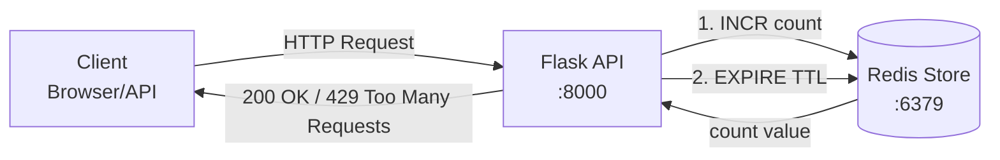
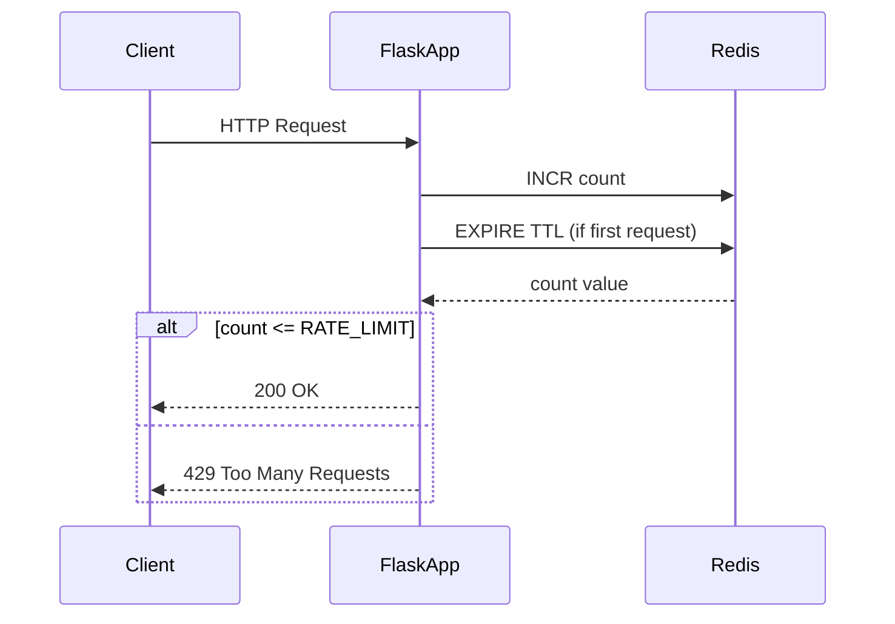

# 1. はじめに

本稿では、**分散システムにおけるAPIレートリミッターの設計と実装**を、ハンズオン形式で解説します。
Flask・Redis・Docker Composeを用い、**固定ウィンドウカウンター方式**を構築。
さらに、Jupyter Notebookで可視化検証を行い、**バースト制御の限界と改善策**を学びます。

## 技術選定理由

| 技術                   | 理由                                        |
| -------------------- | ----------------------------------------- |
| **Flask**            | 軽量で構造が理解しやすく、FastAPIなどへの移行も容易。            |
| **Redis**            | `INCR` / `EXPIRE` による原子的操作が可能で、高速・低レイテンシ。 |
| **Docker Compose**   | Redis + Flask のローカル検証環境を簡単に再現可能。          |
| **Jupyter Notebook** | レートリミット挙動の記録・分析・可視化が容易。                   |
| **Luaスクリプト非使用**      | 教育目的で可読性を優先。厳密運用ではLua対応を推奨。               |


# 2. 理論背景：レートリミッターの方式比較

レートリミッターには複数の方式があり、それぞれトレードオフがあります。

| アルゴリズム       | 概要               | 長所        | 短所                 |
| ------------ | ---------------- | --------- | ------------------ |
| トークンバケット     | トークンを時間で補充し消費で制御 | バースト吸収に強い | 実装がやや複雑            |
| 固定ウィンドウ（本稿）  | 一定期間のリクエスト数をカウント | 実装が簡潔・高速  | ウィンドウ境界でバースト発生しやすい |
| スライディングウィンドウ | 時間重みで連続的に制御      | 精度が高い     | 実装コストが高い           |

本稿では**固定ウィンドウ方式**を採用し、**Redisを分散カウンタとして利用**します。

---

# 3. アーキテクチャ概要

本稿のレートリミッターは、**固定ウィンドウカウンター方式**を採用し、Flask APIとRedisを組み合わせたシンプルな構成です。以下に、アーキテクチャの全体像と処理フローを図示します。

## 処理フロー図（フローチャート）



## 時系列処理図（シーケンス図）



## 図表解説

- **フローチャート**: システム全体のデータフローを示しています。クライアントからのリクエストがFlask APIを経由してRedisに到達し、カウンタの更新とTTL設定が行われた後、レスポンスが返却される流れを簡潔に表現しています。この図は、コンポーネント間の関係性を把握するのに適しています。

- **シーケンス図**: リクエスト処理の時系列を詳細に示しており、Redisとのやり取りとレート制限の条件分岐（カウンタ値が閾値を超えた場合の429エラー）を明確にしています。固定ウィンドウ方式の特性として、ウィンドウ開始時にカウンタがリセットされるため、境界付近でのバースト発生に注意が必要です。

このアーキテクチャの利点は、Redisの原子性操作（`INCR`と`EXPIRE`）により、高速かつ分散環境で動作可能な点です。一方で、固定ウィンドウ方式の欠点として、ウィンドウ境界でのリクエスト集中（バースト）が発生しやすいため、実運用ではスライディングウィンドウへの移行を検討してください。

## 各コンポーネントの役割

* **Flask**: APIエンドポイントを提供（`/api/test`, `/api/reset`）。リクエストの受付とRedis操作、レスポンス生成を担当。軽量フレームワークのため、拡張性が高く、FastAPIなどへの移行も容易。
* **Redis**: カウントとTTLを保持。分散カウンタとして機能し、`INCR`による原子性インクリメントと`EXPIRE`による自動削除を実現。メモリベースのため高速。
* **Docker Compose**: FlaskとRedisを同時に起動。ローカル開発環境を簡単に構築可能。環境変数でレート制限パラメータ（`RATE_LIMIT`, `WINDOW_SECONDS`）を調整可能。
* **クライアント**: curlやNotebookからHTTPリクエストを送信。レスポンスヘッダ（`X-RateLimit-*`）を活用してリトライタイミングを制御。

---

# 4. 実装のポイント（コード省略）

## 実装の主な流れ

1. **クライアント識別**
   IPアドレスをキーに使用。
   → `rate_limit:{client_ip}:{window_start}` 形式で保存。

2. **カウンタ操作**

   * `INCR` でカウントアップ
   * 初回のみ `EXPIRE` 設定
   * カウントが閾値 (`RATE_LIMIT`) を超えると HTTP 429 を返却

3. **レスポンスヘッダ**

   ```
   X-RateLimit-Limit: 最大リクエスト数
   X-RateLimit-Remaining: 残り回数
   X-RateLimit-Reset: リセット時刻
   ```

   **図表解説**: RFC 6585で定義されたレート制限ヘッダーを使用しています。これにより、クライアントは現在の制限状態を把握し、適切なリトライタイミングを決定できます。`X-RateLimit-Reset`はUNIXタイムスタンプ形式で返却され、ウィンドウのリセット時刻を示します。

4. **例外パス**
   `/health` や `/api/reset` は制限対象外。

5. **運用補助**
   `/api/reset` で Redis のキーを削除し、開発検証を容易に。


# 5. ローカル環境構築（Docker Compose）

```yaml
services:
  app:
    build: ./app
    ports: ["8000:8000"]
    environment:
      REDIS_HOST: redis
      RATE_LIMIT: "5"
      WINDOW_SECONDS: "60"
    depends_on: [redis]

  redis:
    image: redis:7-alpine
    ports: ["6379:6379"]
```

**図表解説**: Docker Compose設定により、ローカル開発環境を簡単に構築できます。`app`サービスはFlaskアプリケーションをコンテナ化し、`redis`サービスはRedisデータベースを提供します。環境変数によりレート制限の設定を柔軟に変更可能で、`depends_on`によりRedisの起動を待機してからFlaskを起動します。

# 6. 検証：Notebookで挙動を可視化

Jupyter Notebook（`rate_limiter_test.ipynb`）で自動的に連続リクエストを送信し、
**ステータスコード・残り回数・リセット時刻**を可視化します。

代表的な挙動:

* 最初の5回：HTTP 200
* 6回目以降：HTTP 429
* ウィンドウリセット後：再び許可

**図表解説**: Notebookでは、matplotlibとseabornを用いてレートリミッターの挙動をグラフ化します。左側のグラフは各リクエストのHTTPステータスコードを示し、右側のグラフは残りリクエスト数の推移をプロットします。これにより、固定ウィンドウ方式の境界問題（バースト現象）を視覚的に確認できます。

これにより、**固定ウィンドウ方式の境界問題（バースト現象）**を実際に観測可能です。

---

# 7. 設計上の注意点と運用の勘所

| 項目           | 解説                                                        |
| ------------ | --------------------------------------------------------- |
| **原子性**      | `INCR` と `EXPIRE` を別コマンドで実行すると TTL が設定されない可能性あり。Luaで改善可能。 |
| **時刻同期**     | サーバ時刻がずれると誤判定が発生。NTPによる同期が必要。                             |
| **Redis可用性** | 本番では Sentinel / Cluster / ElastiCache を検討。                |
| **バースト対策**   | スライディングウィンドウまたはトークンバケット方式へ拡張を推奨。                          |
| **監視・メトリクス** | Redis応答時間・429発生率をPrometheus/Grafanaで可視化。                  |
| **エッジ制御**    | API Gateway や CDN レイヤーでの早期拒否も有効。                          |

---

# 8. まとめと今後の発展

## 学びの要点

* Flask + Redis による固定ウィンドウ型レートリミッターを構築。
* 分散環境下での一貫した制限を Redis の原子操作で実現。
* HTTPヘッダ・レスポンス挙動をJupyterで検証し、理論と実践を接続。

## 今後の改善案

* Luaスクリプトで `INCR` + `EXPIRE` の一括原子処理化
* トークンバケット／スライディングウィンドウ実装
* Redis Clusterによる高可用構成
* API Gatewayとの統合制御
