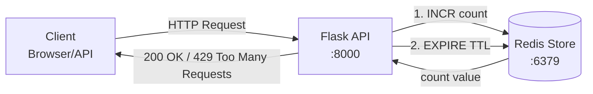

# 1. はじめに

本稿では、**分散システムにおけるAPIレートリミッターの設計と実装**を、ハンズオン形式で解説します。
Flask・Redis・Docker Composeを用い、**固定ウィンドウカウンター方式**を構築。
さらに、Jupyter Notebookで可視化検証を行い、**バースト制御の限界と改善策**を学びます。

> ゴール：採用担当が「この人と一緒に設計したい」と思うような、実践的で説明力のある記事にする。

## 技術選定理由

| 技術                   | 理由                                        |
| -------------------- | ----------------------------------------- |
| **Flask**            | 軽量で構造が理解しやすく、FastAPIなどへの移行も容易。            |
| **Redis**            | `INCR` / `EXPIRE` による原子的操作が可能で、高速・低レイテンシ。 |
| **Docker Compose**   | Redis + Flask のローカル検証環境を簡単に再現可能。          |
| **Jupyter Notebook** | レートリミット挙動の記録・分析・可視化が容易。                   |
| **Luaスクリプト非使用**      | 教育目的で可読性を優先。厳密運用ではLua対応を推奨。               |


# 2. 理論背景：レートリミッターの方式比較

レートリミッターには複数の方式があり、それぞれトレードオフがあります。

| アルゴリズム       | 概要               | 長所        | 短所                 |
| ------------ | ---------------- | --------- | ------------------ |
| トークンバケット     | トークンを時間で補充し消費で制御 | バースト吸収に強い | 実装がやや複雑            |
| 固定ウィンドウ（本稿）  | 一定期間のリクエスト数をカウント | 実装が簡潔・高速  | ウィンドウ境界でバースト発生しやすい |
| スライディングウィンドウ | 時間重みで連続的に制御      | 精度が高い     | 実装コストが高い           |

本稿では**固定ウィンドウ方式**を採用し、**Redisを分散カウンタとして利用**します。

---

# 3. アーキテクチャ概要



* **Flask**: APIエンドポイントを提供（`/api/test`, `/api/reset`）
* **Redis**: カウントとTTLを保持
* **Docker Compose**: FlaskとRedisを同時に起動
* **クライアント**: curlやNotebookからHTTPリクエストを送信

---

# 4. 実装のポイント（コード省略）

## 実装の主な流れ

1. **クライアント識別**
   IPアドレスをキーに使用。
   → `rate_limit:{client_ip}:{window_start}` 形式で保存。

2. **カウンタ操作**

   * `INCR` でカウントアップ
   * 初回のみ `EXPIRE` 設定
   * カウントが閾値 (`RATE_LIMIT`) を超えると HTTP 429 を返却

3. **レスポンスヘッダ**

   ```
   X-RateLimit-Limit: 最大リクエスト数
   X-RateLimit-Remaining: 残り回数
   X-RateLimit-Reset: リセット時刻
   ```

4. **例外パス**
   `/health` や `/api/reset` は制限対象外。

5. **運用補助**
   `/api/reset` で Redis のキーを削除し、開発検証を容易に。


# 5. ローカル環境構築（Docker Compose）

```yaml
version: "3.8"
services:
  app:
    build: ./app
    ports: ["8000:8000"]
    environment:
      REDIS_HOST: redis
      RATE_LIMIT: "5"
      WINDOW_SECONDS: "60"
    depends_on: [redis]

  redis:
    image: redis:7-alpine
    ports: ["6379:6379"]
```

起動（macOS/zsh）:

```bash
cd rate_limiter_design
docker compose up --build -d
```

ヘルスチェック:

```bash
curl http://localhost:8000/health
```

# 6. 検証：Notebookで挙動を可視化

Jupyter Notebook（`rate_limiter_test.ipynb`）で自動的に連続リクエストを送信し、
**ステータスコード・残り回数・リセット時刻**を可視化します。

代表的な挙動:

* 最初の5回：HTTP 200
* 6回目以降：HTTP 429
* ウィンドウリセット後：再び許可

これにより、**固定ウィンドウ方式の境界問題（バースト現象）**を実際に観測可能です。

---

# 7. 設計上の注意点と運用の勘所

| 項目           | 解説                                                        |
| ------------ | --------------------------------------------------------- |
| **原子性**      | `INCR` と `EXPIRE` を別コマンドで実行すると TTL が設定されない可能性あり。Luaで改善可能。 |
| **時刻同期**     | サーバ時刻がずれると誤判定が発生。NTPによる同期が必要。                             |
| **Redis可用性** | 本番では Sentinel / Cluster / ElastiCache を検討。                |
| **バースト対策**   | スライディングウィンドウまたはトークンバケット方式へ拡張を推奨。                          |
| **監視・メトリクス** | Redis応答時間・429発生率をPrometheus/Grafanaで可視化。                  |
| **エッジ制御**    | API Gateway や CDN レイヤーでの早期拒否も有効。                          |

---

# 8. まとめと今後の発展

## 学びの要点

* Flask + Redis による固定ウィンドウ型レートリミッターを構築。
* 分散環境下での一貫した制限を Redis の原子操作で実現。
* HTTPヘッダ・レスポンス挙動をJupyterで検証し、理論と実践を接続。

## 今後の改善案

* Luaスクリプトで `INCR` + `EXPIRE` の一括原子処理化
* トークンバケット／スライディングウィンドウ実装
* Redis Clusterによる高可用構成
* API Gatewayとの統合制御
