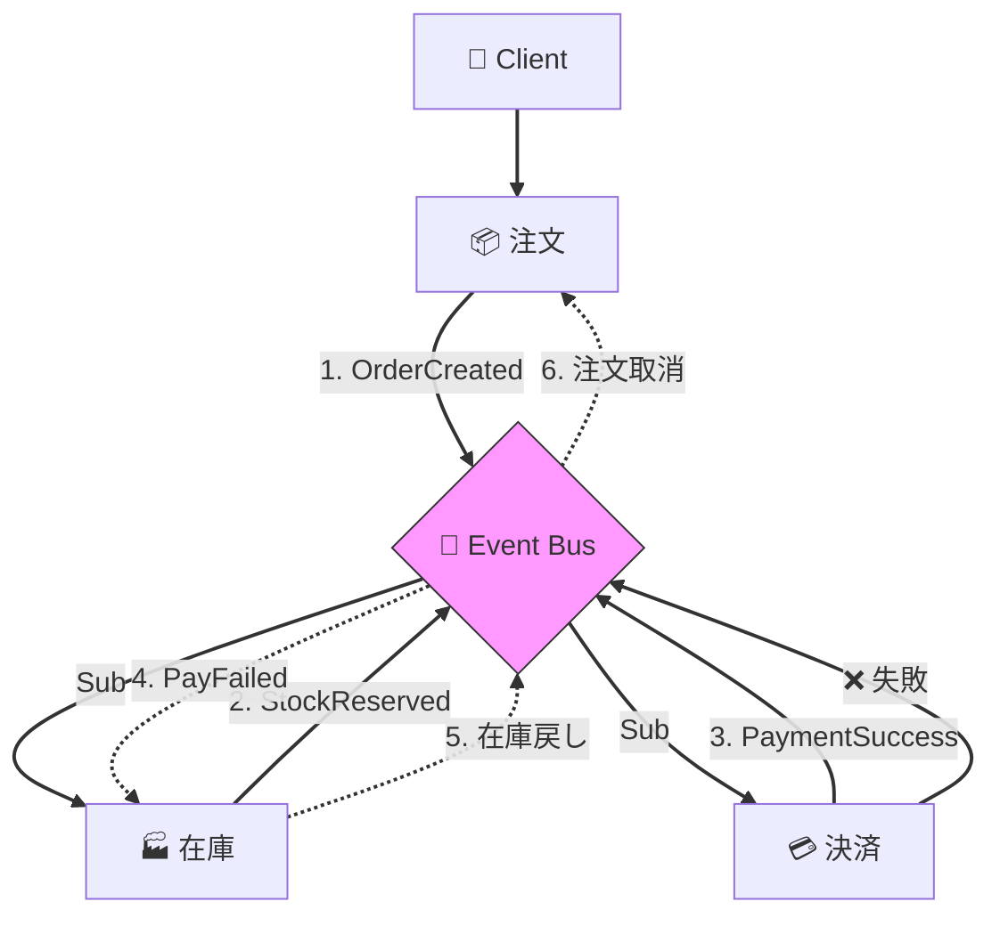
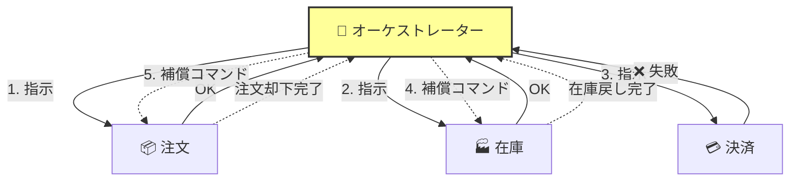

# 分散トランザクション Sagaパターン   面接・暗記用チートシート

システムデザイン面接や通勤中の学習用に、Sagaパターンの要点を凝縮しました。

## 1. Sagaパターンとは？

**「長時間のトランザクションを、小さなローカルトランザクションの連続に分割して実行する手法」**

- **ACID** の代わりに **BASE** (Basically Available, Soft state, Eventual consistency) を採用し、**結果整合性**を保証する。
- 途中で失敗した場合、前のステップを取り消す**補償トランザクション (Compensating Transaction)** を実行して整合性を保つ。

---

## 2. コレオグラフィー (Choreography)

**特徴：「自律分散型・イベントリレー」**

各サービスがイベントを購読し、次のアクションや補償を**自律的**に行う。中央の管理者はいない。

### 図解フロー

### ✅ メリット

- **疎結合**: 参加者が互いを知る必要がない。
- **シンプル**: 小規模なら導入が容易（初期段階）。
- **SPOFなし**: 中心的な調整役が不要。

### ❌ デメリット

- **可観測性が低い**: 全体像の把握が難しく、ログが分散してデバッグ困難。
- **循環依存**: サービス間のイベント連鎖が複雑になりやすい（「スパゲッティ」化）。

---

## 3. オーケストレーション (Orchestration)

**特徴：「中央集権型・指揮者」**

中央の**オーケストレーター**（Saga Manager）が、各サービスにコマンドを送り、ステータスを管理する。

### 図解フロー

### ✅ メリット

- **集中管理**: ビジネスロジックが1箇所にまとまり、フローの把握・管理が容易。
- **可観測性**: 今どこまで進んでいるか、どこで失敗したかが明確。
- **複雑性への対応**: 分岐や待機などの複雑なワークフローを制御しやすい。

### ❌ デメリット

- **SPOFリスク**: オーケストレーターが単一障害点になりうる（高可用性が必要）。
- **結合度**: オーケストレーターにロジックが集中しすぎる（God Class化のリスク）。

---

## 4. 比較まとめ (面接回答用)

| 特徴           | コレオグラフィー (自律) | オーケストレーション (集中) |
| :------------- | :---------------------- | :-------------------------- |
| **制御**       | 分散 (P2P)              | 中央集権                    |
| **結合度**     | 非常に疎                | 疎 (Orchestrator依存)       |
| **適性規模**   | 小〜中規模 (参加者少)   | 大規模・複雑 (参加者多)     |
| **可観測性**   | 低い (追跡困難)         | 高い (一元管理)             |
| **導入コスト** | 低                      | 高 (管理者が必要・Infra増)  |

### 💡 面接でのキラーフレーズ

> 「初期のマイクロサービスや単純なフロー（2-3ステップ）なら**コレオグラフィー**で始めますが、サービス数が増えてフローが複雑（条件分岐など）になったり、可観測性が重要になるフェーズでは**オーケストレーション**への移行、あるいは Temporal / Camunda などのワークフローエンジンの導入を検討します。」
