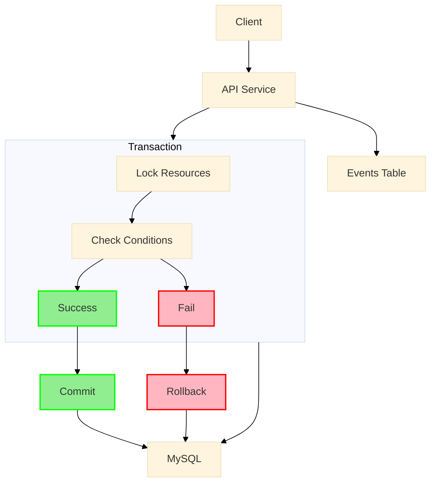

```mermaid
%%{init: {'theme': 'base', 'themeVariables': {'background': '#ffffff'}}}%%
%%{init: {'theme': 'base', 'themeVariables': {'background': '#ffffff'}}}%%
flowchart TD
    Client --> API[API Service]

    API --> Transaction
    subgraph Transaction
        Lock[Lock Resources]
        Check[Check Conditions]
        Success[Success]
        Fail[Fail]

        Lock --> Check
        Check --> Success
        Check --> Fail
    end

    Success --> Commit[Commit]
    Fail --> Rollback[Rollback]

    API --> Events[Events Table]
    Transaction --> MySQL
    Commit --> MySQL
    Rollback --> MySQL

    %% Styling
    classDef success fill:#90EE90,stroke:#00ff00,stroke-width:2px
    classDef fail fill:#FFB6C1,stroke:#ff0000,stroke-width:2px

    class Success,Commit success
    class Fail,Rollback fail
```
