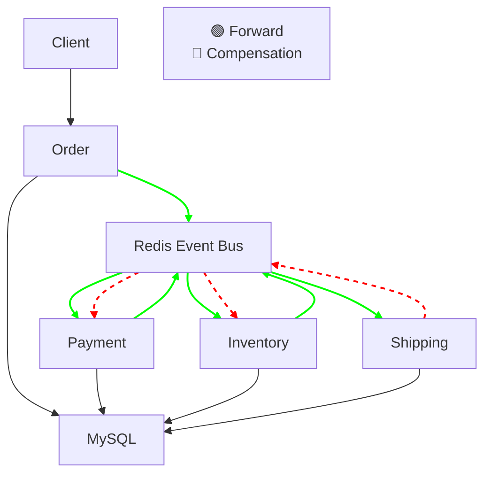

```mermaid
flowchart TD
    Client --> Order
    Order --> Redis[Redis Event Bus]
    Redis --> Payment
    Redis --> Inventory
    Payment --> Redis
    Inventory --> Redis
    Redis --> Shipping

    %% Compensation
    Shipping -.-> Redis
    Redis -.-> Payment
    Redis -.-> Inventory

    %% Data
    Order --> MySQL
    Payment --> MySQL
    Inventory --> MySQL
    Shipping --> MySQL

    %% Legend
    Legend["🟢 Forward<br/>🔴 Compensation"]

    %% Styling
    classDef success fill:#90EE90,stroke:#00ff00,stroke-width:2px
    classDef compensation stroke:#ff0000,stroke-width:2px,stroke-dasharray: 5 5

    linkStyle 1,2,3,4,5,6 stroke:#00ff00,stroke-width:2px
    linkStyle 7,8,9 stroke:#ff0000,stroke-width:2px,stroke-dasharray: 5 5
```
