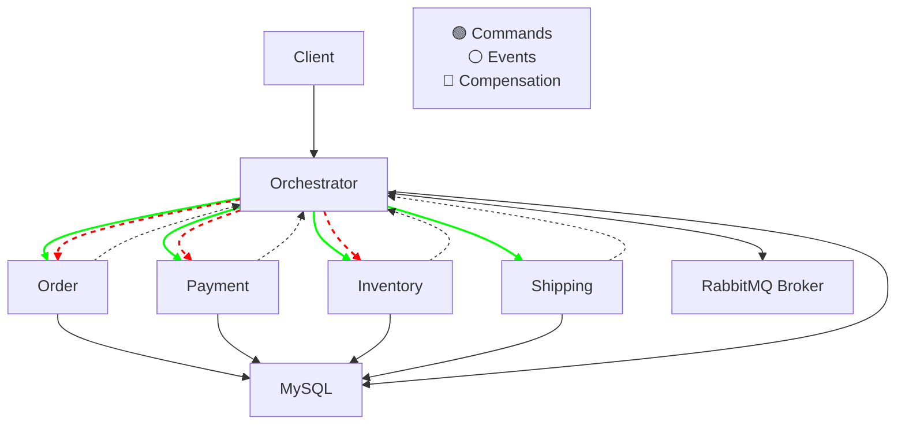

```mermaid
flowchart TD
    Client --> Orchestrator

    %% Commands
    Orchestrator --> Order
    Orchestrator --> Payment
    Orchestrator --> Inventory
    Orchestrator --> Shipping

    %% Events
    Order -.-> Orchestrator
    Payment -.-> Orchestrator
    Inventory -.-> Orchestrator
    Shipping -.-> Orchestrator

    %% Compensation
    Orchestrator -.-> Order
    Orchestrator -.-> Payment
    Orchestrator -.-> Inventory

    %% Broker
    Orchestrator <--> RabbitMQ[RabbitMQ Broker]

    %% Data
    Order --> MySQL
    Payment --> MySQL
    Inventory --> MySQL
    Shipping --> MySQL
    Orchestrator --> MySQL

    %% Legend
    Legend["🟢 Commands<br/>⚪ Events<br/>🔴 Compensation"]

    %% Styling
    linkStyle 1,2,3,4 stroke:#00ff00,stroke-width:2px
    linkStyle 5,6,7,8 stroke:#333,stroke-dasharray: 3 3
    linkStyle 9,10,11 stroke:#ff0000,stroke-width:2px,stroke-dasharray: 5 5
```
