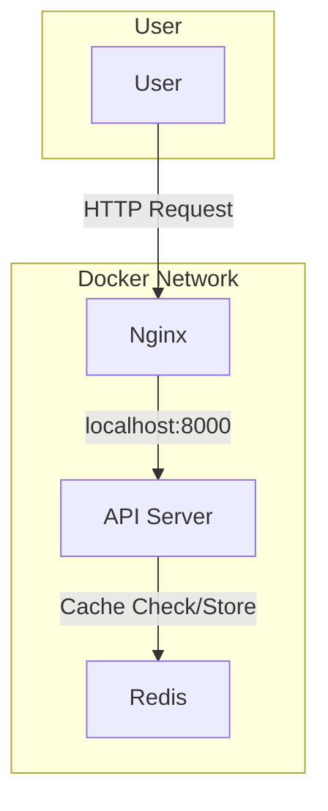

```mermaid
graph TD
    subgraph "User"
        U[User]
    end

    subgraph "Docker Network"
        N[Nginx]
        A[API Server]
        R[Redis]
    end

    U -- "HTTP Request" --> N
    N -- "localhost:8000" --> A
    A -- "Cache Check/Store" --> R

```
